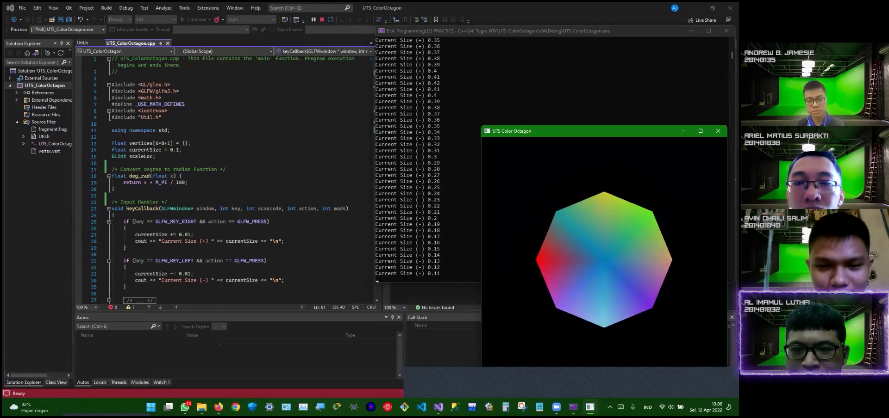
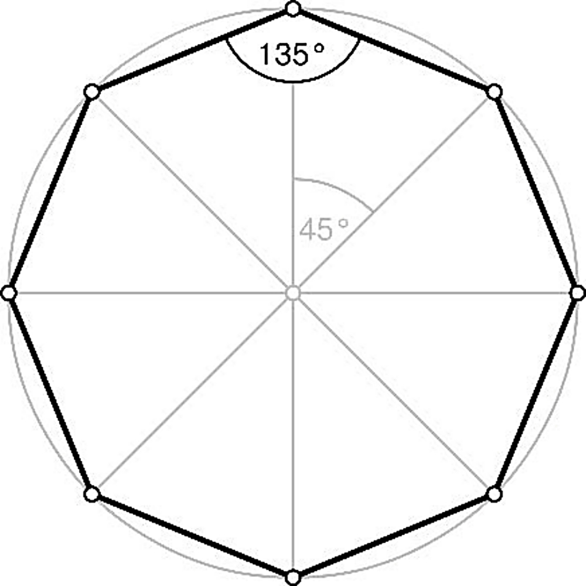
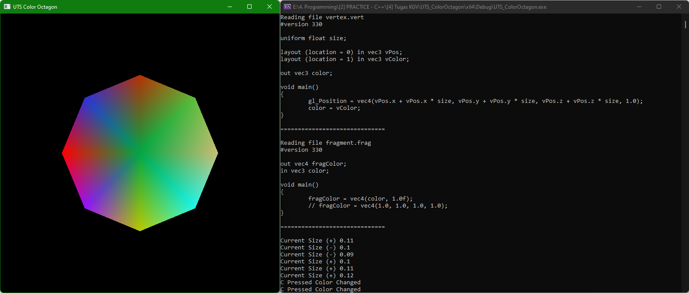

# KGV_UTS_Turing-A
#### Ujian Tengah Semester Mata Kuliah Komputer Grafik dan Visualisasi
#### Dosen Pengampu: Jos Timanta Tarigan, S.Kom., M.Sc.
#### Tahun Ajaran: Genap 2021/2022
#### Ilmu Komputer - Universitas Sumatera Utara

# 
**Kelompok Alan Turing Kom A**  
**1. 201401032 - Al Imamul Luthfi**  
**2. 201401035 - Andrew Benedictus Jamesie**  
**3. 201401038 - Ariel Matius Surbakti**  
**4. 201401040 - Avin Chaili Salim**  

**YouTube Video**  

# 
# Deskripsi Tugas
> 
> 
> Anda ditugaskan untuk membangun sebuah aplikasi komputer grafis menggunakan GLFW dan GLEW yang menampilkan sebuah _octagon_ (_polygon_ sisi 8). Adapun spesifikasi gambar yang harus ditampilkan adalah sebagai berikut,
> 1. Setiap sisi _octagon_ memiliki panjang yang sama. _Octagon_ dibangun dengan menggunakan 8 buah segitiga. Data _vertex_ harus disusun ke dalam sebuah _vertex buffer_ dan _index buffer_. Data _vertex_ tidak boleh berulang. Definisi posisi _vertex_ (nilai x dan y dari setiap _vertex_) harus menggunakan sebuah rumus dan tidak boleh _hard-coded_ **(30 poin)**
> 2. Setiap segitiga pada _octagon_ memiliki warna yang berbeda. Gunakan _fragment shader_ untuk melakukan pewarnaan segitiga ini! Tambahkan animasi di mana warna setiap segitiga akan berubah setiap detik! **(30 poin)**
> 3. Tambahkan _input-handler_ pada program Anda yang dapat mengubah ukuran _octagon_ (perbesar dan perkecil) dan dapat mengubah warna _octagon_! Pemilihan warna dilakukan secara acak! **(30 poin)**
> 
> Anda juga ditugaskan untuk membuat satu buah video tutorial yang menjelaskan aplikasi dan kode yang Anda bangun dengan durasi minimal 5 menit dan maksimal 7 menit. Video Anda harus memiliki spesifikasi sebagai berikut,
> 1. Video harus menampilkan logo USU/Fasilkom-TI di awal Video;
> 2. Video harus menampilkan nama dan NIM setiap anggota kelompok;
> 3. Video harus menampilkan orang yang sedang menjelaskan;
> 4. Suara yang dihasilkan oleh orang harus jelas;
> 5. Ukuran video minimal adalah 720p (1280 x 720) dan seluruh teks (presentasi, kode) harus dapat terbaca dengan jelas.
> 
> Unggah _project_ Anda (yang dapat dijalankan pada Visual Studio) pada GitHub dan lampirkan _link_ GitHub pada deskripsi video Anda. **(10 poin)**
> 
> **Metode dan Batas Waktu Pengumpulan**
> Video diunggah ke Youtube. Link dikumpulkan via e-Learning dengan menggunakan _activity_ yang telah ditentukan. Adapun batas waktu pengumpulan adalah **Selasa, 12 April 2022 pukul 23.59 WIB**.

# 
# UTS KGV Kelompok Turing-A
**UTS_ColorOctagon**
> - Project ini berupa program visual untuk menampilkan bangun datar segi delapan atau poligon segi delapan (_octagon_) dengan warna acak (_random_) yang berbeda-beda untuk setiap bagiannya yang dibentuk dari delapan (8) segitiga. Bangun datar _octagon_ ini bisa berubah warna setiap detik dan bisa juga **mengubah warnanya** secara langsung dengan menekan tombol `C` di _keyboard_. Bangun data _octagon_ ini juga bisa diubah ukurannya dengan menekan tombol `panah kiri (←)` untuk **memperkecil** ukurannya, dan tombol `panah kanan (→)` untuk **memperbesar** ukurannya.
> - Folder ini merupakan project/solution **Console Application** Visual Studio, sehingga bisa di-_compile_ dan dijalankan dengan menggunakan Microsoft Visual Studio.
> - Dalam folder ini terdapat file Program `.sln` yang dapat dibuka dengan menggunakan Visual Studio.
> - Sedangkan jika hanya ingin melihat _source code_-nya akan dijelaskan di bawah.
> 
> **Colored Octagon**  
> 

# 
# Note:
#### Dalam folder ini terdapat 4 file yang penting, yaitu:
- **UTS_ColorOctagon.cpp**  
  Ini adalah _file_ utama dari project/solution ini. Dalam _file_ ini dilakukan pembuatan _window_ untuk menampilkan gambar bangun datar _octagon_, perintah untuk mengganti warna dan ukuran, perintah untuk melakukan penggambaran dan pewarnaan bangun datar _octagon_ dengan `vertices vertexBuffer` dan `indexArr indexBuffer`, serta melakukan _link_ dan _bind_ dengan _file_ `vertex.vert` dan `fragment.frag` untuk melakukan _render shader_.
- **Util.h**  
  Ini adalah _file_ untuk menghubungkan _file_ utama `UTS_ColorOctagon.cpp` dengan _file_ vertex dan fragment, yaitu `vertex.vert` dan `fragment.frag`. _File_ ini juga berfungsi untuk melakukan _debugging_ yang akan ditampilkan pada console/terminal pada saat menjalankan (_run_) program.
- **vertex.vert**  
  Ini adalah _file_ untuk menentukan penggambaran posisi dari `vertices` dan `indexBuffer` yang akan dihubungkan dengan variabel uniform `size` untuk melakukan pengubahan ukuran gambar bangun datar _octagon_. Serta menentukan warna `color` yang diambil dari `vColor` dengan pointer location 1, sedangkan `vPos` dengan pointer location 0.
- **fragment.frag**  
  Ini adalah _file_ untuk menentukan pewarnaan fragment color, yaitu `fragColor` yang diambil dari `color` milik `vertex.vert` untuk menghasilkan warna yang acak atau _random_.
